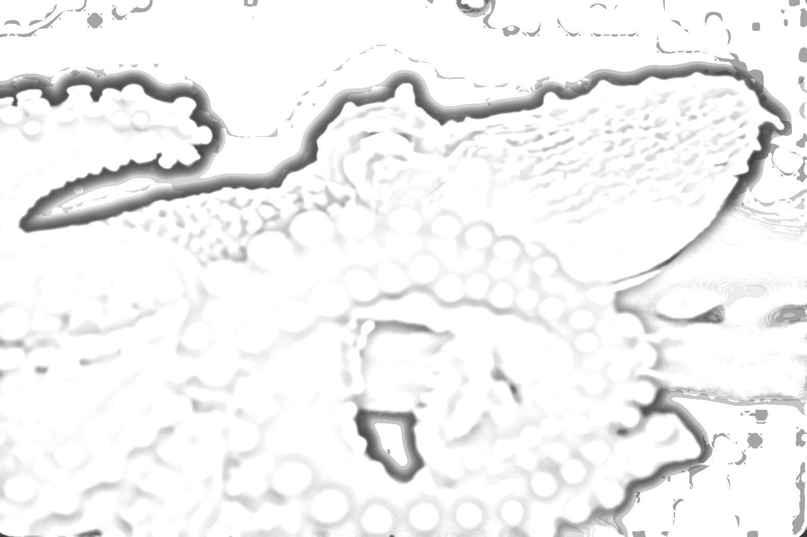
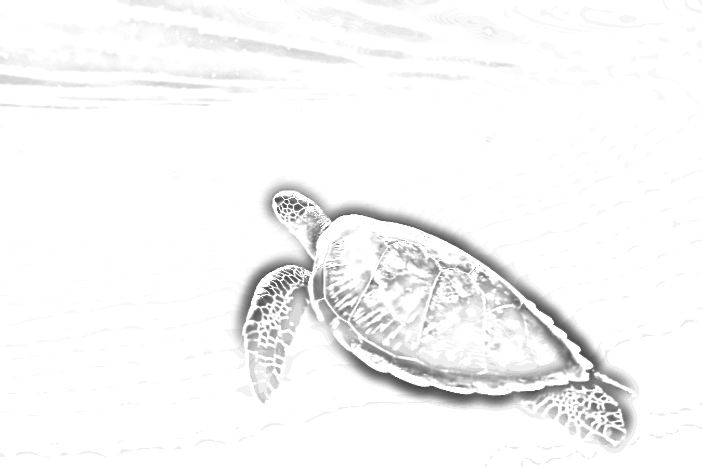

<h1 align="center">Lorenzo Vignoli</h1>

<em>PhD in Robotics &middot; EPFL CREATE Lab &middot; Lausanne</em>

  
  
  
  

---

### Research interests

My interests lie in the integration of compliant control and machine learning for the design, modeling, and control of soft and continuum mechanical systems, with a particular focus on bio-inspired robotics where rigid-body paradigms are limited. I am especially drawn to embodied intelligence and impedance-shaped interaction, exploring how the natural dynamics of compliant bodies can be harnessed instead of canceled, to achieve dexterous manipulation and adaptive locomotion. My goal is to develop principled frameworks for perception and control that enable robust and versatile behavior in contact-rich environments.

 

<table>
<tr>
<td align="center" width="33%" style="padding: 6px 10px 4px;">
  

    
  

  <h3 style="margin: 0;">Interaction control of soft robots</h3>
</td>
<td align="center" width="33%" style="padding: 6px 10px 4px;">
  

    
  

  <h3 style="margin: 0;">Modeling and sensing of compliant structures</h3>
</td>
<td align="center" width="33%" style="padding: 6px 10px 4px;">
  

    
  

  <h3 style="margin: 0;">Design of bio-inspired robots</h3>
</td>
</tr>
</table>

